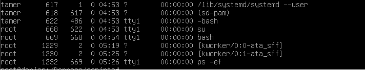

## Paramétrages Linux

- On utilise toujours un compte à accès restreint et ensuite on exécute les commandes en mode superutilisateur. De cette façon, si l'on trouve le mot de passe de notre utilisateur, le "hacker" n'a aucun accès au superutilisateur.

- On choisit des mot de passe différents ainsi qu'un nom d'utilisateur assez dur à trouver pour garantir une sécurité maximale.

## Types de disques durs

    sda -> SCSI Disk A (pour le premier disque)
    de type:
        - ext4 : extended4 système de fichier journalisé.
        - swap : échange

On ajoute un UUID aux disques et aux partitions pour éviter de perdre nos données si nous changeons un disque dur d'emplacement SAS/SATA ou si l'on rajouter une partition entre deux déjà existantes.

* Chez Windows on travaille avec un fichier d'échange.

* Sous Linux on travaille avec une partition d'échange.

## Configuration IP

Il est important de configurer une IP statique à un serveur __le plus rapidement possible__ afin de pouvoir y accéder à distance et donc éviter d'aller en salle de serveur tout le temps.

Le nom des interfaces et changé, par exemple:

- lo : interface de loopback
- ens32 : interface réseau (adresse ip: 192.168.XXX.XXX) nommé inet
    - link/ether = adresse MAC
    - inet6 : réseau IPv6

## Commandes liés

- iproute : 
    - va retourner par exemple: "default via 192.168.64.2 dev ens32"
    - qui veut dire qu'on doit contacter la default gateway via notre interface ens32.

- _ip -4 a_ : n'affiche que la configuration IPv4
- _ip -6 a_ : n'affiche que la configuration IPv6
- _ip a show ens32_ : n'affiche les paramètres d'adresse de l'interface ens32.
- _ip link ls up_ : n'affiche que les interfaces qui sont "up".

- _ip a add 192.168.13.101/24 dev ens34_ : permet d'ajouter l'adresse IP à l'interface ens34.
- _ip a del 192.168.13.101/24 dev ens34_ : permet de supprimer l'adresse IP à l'interface ens34.
- _ip link set up dev ens34_ : permet de monter l'interface ens34.
- _ip link set down dev ens34_ : permet de démonter l'interface ens34.
- _ip link set mtu 1400 dev ens34_ : permet de modifier la MTU liée à une interface réseau.

## Fichiers Linux

- On peut modifier les configurations d'interfaces réseaux dans /etc/network/interfaces
```
allow-hotplug ens34
iface ens34 inet static
    address 192.168.13.101
    netmask 255.255.255.0
    network 192.168.13.0
    broadcast 192.168.13.255
    gateway 192.168.13.1
```

- Dans le fichier fstab (pour File System tab) (dans /etc/), on peut voir tous les points de montages, on peut aussi voir que chaque point de montage à un identifiant unique.
Pour éviter la casse (il est possible de ne plus du tout accèder au dossier racine) on peut faire : "cp /etc/fstab /etc/fstab.org"

- Dans le dossier /dev/, on peut trouver les différents points de montage du système qui correspondent à une interface physique. 

- Les fichiers cachés ont leur nom qui commence par un point.

- On peut aller voir le fichier "resolv.conf" (se trouvant dans /etc/).
    - On peut aller voir dedans les serveurs de noms qu'on devra / pourra contacter.
    - On peut par exemple ajouter le dns de google en ajoutant:
    ```
        dns-nameservers 8.8.8.8 8.8.4.4
    ```

- Dans le dossier _/etc/apt/_, on retrouve un fichier _sources.list_ qui contient l'adresse des serveurs 

## Elements linux

- '/' : répertoire racine, sommet d'arborescence unique.
- '.' : répertoire courant.
- '..' : lien vers le répertoire parent (est un fichier).
- $PATH : variable d'environnement comprenant l'ensemble des endroits à chercher pour un exécutable, si l'on tape une commande qui n'est pas liée aux commandes internes.

## Commandes linux

- _cd_ -> Change Directory -> Changement absolu, on ne peut accéder à des dossiers qui font parti du dossier courant. L'usage de la commande `cd` toute seule permet à l'utilisateur de se déplacer dans son fichier racine.
- _ls [-al]_ -> Montre ___tous___ (grâce à -al) les nodes du répertoire courant.
    - Grâce à cette commande, on peut voir les droits en lecture / écriture sur les différents dossiers / fichiers du répertoire visé. 
    - exemple:
        - -rwx--r--r-- root root : Le super utilisateur `root` à les droits en lecture/écriture, le groupe utilisateur `root` à les droits en lecture. Les autres utilisateurs ont le droit de lecture.
    - param _[-li]_ -> Pour afficher le numéro d'iNode.
- _pwd_ -> print working directory.
- _cp_ -> Copy, permet de copier un fichier ou alors d'effectuer une sauvegarde, exemple: `cp interfaces interfaces.org`. interfaces.org contient donc le backup de notre fichier interfaces.
- _shutdown -h now_ : Eteint le serveur.
- _su_ Permet de devenir le `superutilisateur` de l'environnment de travail.
- _find / -name iptables_ Permet de trouver le chemin, ici, à partir du sommet de l'arborescence jusqu'à iptables. 
- _ip link set up <interface>_ Permet, ici, de connecter la couche de liaison liée à l'interface.
- _apt-get [install/remove/purge/...] <package>_ Permet d'installer, de modifier, de supprimer un package. _remove_ et _purge_ suppriment tout deux un package mais la commande _purge_ enlève aussi les fichiers de configuration associé au package.
- _grep_ Permet de rechercher un pattern à l'intérieur d'un fichier.
- _cmp_ On peut comparer deux fichiers bytes par bytes
- _diff_ On peut comparer deux fichiers lignes par lignes
- _| more_ permet d'injecter la sortie standard dans l'entrée de la première commande, more permet de voir les informations mais de limiter la hauteur à la hauteur de notre résolution d'écran.
- _head [-n <int>]_ retourne le début d'un fichier
- _tail_ retourne les dix dernières lignes d'un fichier
- _wc [-l] <file>_ retourne le nombre de lignes, mots et bytes pour chaque fichier
- _who_ Affiche les users connectés au temps t
- _w_ Affiche les users connectés et ce qu'ils font (utile ;) )
- _id [user]_ Affiche les identifiants d'utilisateur et de groupe effectifs et réels
- _<cmd> [2]>[>] <file>_ envoie le résultat de la commande dans le fichiers, un simple `>` overwrite le fichier, tandis qu'un double va l'ajouter au fichier, le `2>[>]` est utilisé pour seulement renvoyer les erreurs

Si on est connecté comme root, les dossiers personnels sont dans le dossier `/root`.

Si l'on est connecté comme un utilisateur normal, les dossiers personnels sont localisés dans `/home/$USER`.

## Les Manpages

Soit X, une commande dont on désire connaître le fonctionnement.

Nous pouvons accéder à son manuel en tapant dans notre console _man X_.

## Iptables

Firewall : Le firewall est un peu fait à la sauce Microsoft, il n'est pas stateful

On peut démontrer qu'iptables est par défaut stateless, nous pouvons vérifier cela en tapant la commande : "/usr/sbin/iptables -L"

Pour transformer iptables en firewall stateful.

Pour dropper tous les paquets en entrée on peut taper la commande : "./iptables -P INPUT DROP"
Pour les accepter : "iptables -P INPUT ACCEPT"

## SSH

Le daemon SSHD n'est pas protégé de base, on peut aller éditer la configuration dans : "/etc/ssh/sshd_config"

Nous avons par exemple les propriétés:
- Port <int> : Permet de configurer le port sur lequel on va accéder pour ssh.
- ListenAddress 0.0.0.0 | :: : Permet de set l'adresse réseau sur laquelle écouter IPv4 et/ou IPv6.
- MaxAuthTries <int> : Permet de configurer un nombre d'essais d'authentification de base.
- MaxSessions <int> : Permet de configurer un nombre de sessions simultanées par défaut.
- LoginGraceTime 2m : Permet de configurer un temps maximal pour se connecter à un utilisateur.

## Créer une partition

Comme dit plus haut, on peut trouver les points de montage dans le dossier `/dev/` la structure d'un disque est comme celle-là:
S
D
X : Lettre (a,b,...) désignant le numéro du disque physique
<Number> : Numéro de partition

Il n'y a pas de nombre pour un disque non partitionné.
On va donc le partition et ensuite le formater dans le système de fichier journalisé ext4 puis monter la partition pour pouvoir utiliser l'espace de stockage.

On utilisera l'utilitaire fdisk pour le partitioner `/usr/sbin/fdisk /dev/sdb`, on peut créer une nouvelle partition avec la touche `n` on suit ensuite les consignes données et on peut par après sauvegarder nos changements avec la touche `w`.

On peut ensuite le formater en ext4 avec la commande `/usr/sbin/mkfs.ext4 /dev/sdb1`.

Pour la monter, on peut faire `mount -t ext4 /dev/sd1 <dir>` : Dir est le dossier à partir duquel on pourra accèder à notre partition.
Si l'on veut enlever le montage, on peut utiliser la commande `umount <dir>`.

## Les principaux dossiers Linux

/dev -> devices.
/home -> fichiers des utilisateurs.
/var -> fichiers temporaires ou qui vont changer au fil du temps.
/root -> fichiers du super utilisateur?
/bin & /sbin -> binaire -> exécutables (soit du système d'exploitation ou alors des commandes externes utilisables par les utilisateurs).
/media -> répertoire contenant des points de montage pour des cd.

## Les fichiers Linux
- passwd dans /etc/ -> contient tous les utilisateurs du système
```
root:x:0:0:root:/root:/bin/bash
daemon:x:1:1:darmon:/usr/sbin:/usr/sbin/nologin
...
<user>:x:1000:1000:<usergroup>,,,:/home/<user>:/bin/bash
```
On retrouve:
    - Le nom d'utilisateur
    - Un x qui correspondait, avant, au stockage du mot de passe
    - un UID pour l'utilisateur
    - un UID pour le groupe d'utilisateur
    - le groupe d'utilisateur
    - le répertoire
    - la faculté de login ou non

- group dans /etc/ -> contient des informations sur les groupes d'utilisateurs du système

- shadow -> stocke les mots de passe hashés des utilisateurs


## Changer les droits d'un fichier

On utilise la commande `chmod` rwx|rwx|rwx
                               421|421|421 -> octal
Pour mettre un fichier en RW pour soi et r pour le groupe SEULEMENT, on utilisera la commande: `chmod 640 <nomdefichier>.ext`

On peut créer un script basique : 
```sh
#!/bin/sh
echo "toto"
```
Si l'on demande à exécuter le fichier, la permission nous sera, par défaut, refusée, on pourra donc ajouter une permission rwx (read/write/exec) pour soi et r pour le groupe SEULEMENT
`chmod 740 <nomduscript>.sh`

On peut aussi éditer les permissions en mode symbolique: 
`ugoa [-+=] <perms>`
 - u : user
 - g: group
 - o: other
 - a: all
 - <perms> : r | w | x

## Changer le mot de passe

Nous pouvons changer le mot de passe pour un utilisateur avec la commande `passwd`

En regardant les permissions du fichier `passwd` on peut voir : `-rwsr-xr-x 1 root root` -> on peut voir que tout le monde peut exécuter le fichier mais c'est root qui a accès au flag `s` qui est le SetUID, ce flag permet l'exécution d'un programme en tant qu'administrateur même en étant logger sur un utilisateurlambda.


## Infiltrer une machine 

Si une machine est ouverte on peut faire > 
```sh
cp /usr/bin/bash /home/<user>/bash
cd /home/<user>/
chmod u+s bash
```
On pourra accéder à des fichiers root en faisant `/home/<user>/bash -p`
Dès lors, on pourra faire:
```sh
cd /root
cat données_sensibles.txt
```


## RAID

RAID0 (stripping) => 2 disques mini. Les disques fonctionnent en parallèle
RAID1 (mirroring) => 2 disques mini. Un des disques est une copie de l'autre
RAID5 => 3 disques mini. 1 disque de défectueux
RAID6 => 4 disques mini. 2 disques défectueux
RAIDX0 => Un raid X combiné dans un RAID0

- `apt-cache search mdadm`
- `apt-get install mdadm`
- On doit config les disques et créer une partition avec un nombre de blocs identiques sur chacun des disques. Pour une partition < que 2To -> fdisk sinon gdisk
- Création de la grappe: 
    - /dev/mdX : correspond au nom de la grappe
    - --level=Y: indique le RAID Y souhaité
    - --raid-devices=Z: le nombre de disques
    - Le nom des disques
- `./mdadm --create /dev/md0 --level=5 --raid-devices=3 /dev/sdb1 /dev/sdc1 /dev/sdd1`
- On peut visualiser l'état de création avec `cat /proc/mdstat`
- Infos sur le disque virtuel créé :
    - `./mdadm --detail /dev/md0`
    - `./fdisk -l`
- Formater le disque virtuel:
    - `./mkfs.ext4 /dev/md0`
- Monter le disque virtuel:
    - `mkdir /MonRaid`
    - `mount /dev/md0 /MonRaid/`
- Etendre un RAID:
    - `./mdadm --manage /dev/md0 --add /dev/sde1`
    - A ce moment-là, le disque est pris comme disque de spare
- Ajouter le stockage de spare au RAID:
    - `./mdadm --grow /dev/md0 --raid-devices=4`
    - `./mdadm --detail /dev/md0`
    - `./resize2fs /dev/md0`

### Mdadm et défaillance d'un disque
- La tolérance dépend du type de RAID (aucune pour 0, un disque pour 5, deux pour 6)
- Pour prévenir les défaillances il est préférable de détecter des erreurs de disque au plus bas niveau en utilisant les données SMART. 
- Si SMART nous indique un problème sur le disque sdc: 
    - Déclarer le disque défectueux dans la grappe.
    - Supprimer le disque défectueux de la grappe.
    - Remplacer le disque défectueux.

- Le marquer comme défectueux:
    - `./mdadm --manage /dev/md0 --set-faulty /dev/sdc1`
- Le supprimer:
    - `./mdadm --manage /dev/md0 --remove /dev/sc1`
- Le remplacer:
    - `./mdadm --manage /dev/md0 --add /dev/sdc1`

### Sauvegarde configuration MDADM
- `./madadm --examine --scan --verbose`
- `cp /etc/mdadm/mdadm.conf /etc/mdadm/mdadm.conf.old`
- `./mdadm --examine --scan --verbose >> /etc/mdadm/mdadm/conf`
- `./update-initramfs -u -k all`

### MDADM et le monitoring
- On peut éditer le fichier mdadm.conf et modifier la ligne:
    - `MAILADDR root` en remplaçant root par notre adresse mail.
    - L'envoi d'un mail nécessite un agent relai smtp installé sur l'environnement Linux

## Création d'un utilisateur
- Utilisation de la commande `adduser` -> crée l'utilisateur toto, le groupe primaire auquel il appartient (toto), le répertoire du user dans /home/ et /bin/bash

## Changer le propriétaire d'un fichier
- Utilisation de la commande `chown` -> change les droits de possession d'un fichier 
    -> `chown toto:toto ./msg.txt`
- Utilisation de la commande `chgrp` -> change le groupe propriétaire d'un fichier / dossier

## Création d'un groupe
- Utilisation de la commande `groupadd`
- `groupadd Comptable`

## Modifier un compte utilisateur
- Utilisation de la commande `usermod`
- `usermod -a -G Comptable toto`

## Changer les droits d'un groupe
- `chmod 750 <fichier>` pour enlever les droits d'accès aux restes des utilisateurs, RAPPEL: 7 pour RWX pour le propriétaire, 5 pour RX pour le groupe, 0 pour rien pour les autres
- `chown :Comptable <fichier>`
- A ce point le groupe comptable ne peut pas écrire dans le fichier
- `chmod g+w <fichier>`

## Commandes liées aux ressources : Processus
- Gestion des resources
- `ps aux` : Permet un standard d'affichage
- `ps -ef` : Permet de montrer les PIDS et PPID (Parent Process Identifier): 



Une ligne : `<group> <PID> <PPID> 0 <time> <command>`
e.g.: `root 876 817 0 <time> sleep 2`
      `wilfart 817 651 0 <time> -bash`

- `pstree <user>`: Liste des processus sous forme d'arbre (possibilité de tirer sur un utilisateur).

- rcX.d : runlevel, ils sont utilisés au démarrage par init.d pour démarrrer les bons services.

- `systemctl list-unit-files [| grep enabled]` : retrouve tous les services existant [seulement ceux qui sont activés]
- `systemctl kill <service>` : Envoie un signal d'arrêt (SIGTERM) au processus

## Créer un service

- Créer un fichier <nom-du-service>.service dans `/etc/systemd/system/`
- Contenu:
```
[Unit]
Description=Mon service 
After=tlp-init.service
[Service]
Type=oneshot
RemainAfterExit=no
ExecStart=/usr/local/bin/<nom-de-service>.sh
[Install]
WamtedBy=multi-user.target
```

- `systemctl get-default` : Get le niveau de démarrage par défaut
- `systemctl set-default multi-user.target` : Set le niveau de démarrage

- Créer un dossier dans `/usr/lib/` 
- Copier le script dedans

## Arrêter un service (bruteforce)
- `kill -KILL <PID>`

Options de Kill:
- HUP
- INT  : 
- KILL : kill
- STOP : stop
- CONT : continue

## Arrêter un service (manière douce)
- `Ctrl+C` : Le kill
- `Ctrl+Z` : Le stoppe et le met en tâche de fond


## Jobs
- `jobs` : permet de voir les scripts qui ont étés stoppés
- Pour reprendre un job, on peut faire: `fg %<index>` en foreground ou `bg %<index>` en background

`find / -name toto > "test.txt" 2>&1 1` : affiche tout (erreurs,etc)

## Allouer des ressources

- Il existe une commande `nice` permettant de fixer les privilèges pour une commande.
- `nice [option] [command arg ...]` 
- Il existe une option `n` permettant de fixer le niveau de privilège (entre -20 et 19)

- On peut voir le niveau de privilège avec la commande `ps -l`

- Avec la commande `renice 10 -p <PID>` : donne une nouvelle priorité à un PID

- On peut démarrer un script avec une certaine priorité `nice -n <prio> [commande]`